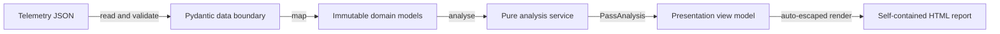

# Spacecraft Telemetry Pass Reporter

An AI-assisted learning and portfolio project built around a compact Python command-line
application. It validates fictional spacecraft-pass telemetry, applies configurable operating
limits, and produces a polished, self-contained HTML report. The emphasis is on explicit
boundaries, typed data, deterministic rules, actionable errors, and automated verification.

> **Educational scope:** All spacecraft names and telemetry in this repository are fictional.
> This project is not a complete spacecraft-operations system and must not be used for mission
> decisions.

Two generated examples are included:

- [`examples/nominal-pass-report.html`](examples/nominal-pass-report.html)
- [`examples/warning-pass-report.html`](examples/warning-pass-report.html)

## Architecture

The package deliberately uses four small layers, wired together by a small CLI:

- **Data** validates untrusted JSON with Pydantic v2 and maps it into domain objects.
- **Domain** defines immutable telemetry, limit, status, and analysis value objects.
- **Services** applies pure threshold rules and calculates events, counts, and statistics.
- **Presentation** builds an escaped view model and renders it with a Jinja2 HTML template.
- **CLI** wires those pieces together, handles expected failures, and writes the result.



This separation keeps Pydantic, files, terminal output, and HTML out of the business rules. The
analyser accepts a validated `TelemetryPass` and returns a `PassAnalysis` without side effects.

## Project structure

```text
.
├── src/telemetry_report/
│   ├── data/             # Pydantic schemas and JSON repository
│   ├── domain/           # Framework-independent value objects
│   ├── presentation/     # HTML view model, renderer, and template
│   ├── services/         # Deterministic threshold analysis
│   ├── cli.py            # Argument parsing and dependency wiring
│   └── __main__.py       # python -m entry point
├── sample-data/          # Nominal and warning/critical fictional passes
├── examples/             # Generated, reviewable HTML reports
├── tests/                # Behaviour-focused pytest suite
├── .github/workflows/    # Cross-version quality workflow
└── pyproject.toml        # Package metadata and tool configuration
```

## Setup

Python 3.11 or newer is required. From the repository root:

```bash
python -m venv .venv
```

Activate the environment on Windows PowerShell:

```powershell
.venv\Scripts\Activate.ps1
```

Or on macOS/Linux:

```bash
source .venv/bin/activate
```

Install the application and development tools:

```bash
python -m pip install --upgrade pip
python -m pip install -e ".[dev]"
```

## Generate a report

Run the module directly:

```bash
python -m telemetry_report sample-data/warning-pass.json \
  --output examples/warning-pass-report.html
```

The installed console command is equivalent:

```bash
telemetry-report sample-data/nominal-pass.json --output examples/nominal-pass-report.html
```

When `--output` is omitted, the reporter writes `<input-stem>-report.html` beside the input file.
The immediate output path is created when needed. Success returns exit code `0`; invalid input and
output failures return non-zero codes with concise messages on standard error.

## Input format

Each JSON document contains pass metadata, limits for all three supported metrics, and at least one
timestamped reading:

```json
{
  "pass_id": "PASS-001",
  "spacecraft": "AURORA-1",
  "started_at": "2026-08-05T09:30:00+09:30",
  "limits": {
    "battery_voltage": {"direction": "minimum", "warning": 3.6, "critical": 3.4},
    "temperature_c": {"direction": "maximum", "warning": 40.0, "critical": 50.0},
    "signal_strength_dbm": {"direction": "minimum", "warning": -90.0, "critical": -105.0}
  },
  "readings": [
    {
      "timestamp": "2026-08-05T09:30:00+09:30",
      "battery_voltage": 3.8,
      "temperature_c": 27.5,
      "signal_strength_dbm": -82.0
    }
  ]
}
```

All timestamps must include a UTC offset. Readings must be non-empty, unique, and strictly
chronological. `started_at` must equal the first reading timestamp. Numeric values must be finite,
and unknown fields are rejected.

For a `minimum` rule, values at or below the warning threshold are warnings and values at or below
critical are critical. For a `maximum` rule, values at or above warning are warnings and values at
or above critical are critical. Consequently, a minimum warning threshold must be greater than its
critical threshold; maximum thresholds use the opposite ordering. The most severe metric determines
the reading status, and the most severe reading determines the pass status.

## Quality checks

```bash
ruff format --check .
ruff check .
mypy src
pytest
```

`pytest` is configured to measure branch coverage for the application package and fail below 90%.
To apply formatting before checking, run `ruff format .`.

The GitHub Actions workflow runs formatting, linting, mypy, and the complete coverage-enabled test
suite on Python 3.11, 3.12, 3.13, and 3.14.

## Design decisions and trade-offs

- **Validation stops at the boundary.** Pydantic provides precise external-data errors, while the
  rest of the application uses frozen standard-library dataclasses and enums.
- **The metric set is explicit.** Three named fields introduce a little repetition, but preserve
  strong types and keep the supported input contract obvious. A dynamic plug-in system would be
  unnecessary for this project's scope.
- **Threshold equality is unsafe-side inclusive.** Exact boundaries consistently become warning or
  critical, avoiding ambiguous edge behaviour.
- **Events are metric-level.** One reading may produce several chronological events, making the
  report explain which individual measurements caused its aggregate severity.
- **Rendering is self-contained.** Embedded CSS makes reports portable and offline-friendly. There
  is no JavaScript, external font, CDN, database, or network dependency.
- **Statistics are descriptive.** Minimum, maximum, and arithmetic mean are useful for demonstration
  but do not model sensor uncertainty, sampling gaps, calibration, or operational trend analysis.

## Scope limitations

This educational application processes a fixed JSON schema and three metrics. It does not provide
authentication, streaming ingestion, persistence, command verification, alert acknowledgement,
redundancy, unit conversion, audit controls, sensor-quality modelling, or any certification expected
of real mission software. The sample values are plausible-looking fiction, not real telemetry.

## Responsible AI assistance

This project was developed with substantial AI assistance across architecture, implementation,
testing and documentation. I used it as a structured learning exercise and then worked through the
core Python models, telemetry-classification rules and report-building flow. I am continuing to learn
some of the supporting libraries and tooling.

## License

Released under the [MIT License](LICENSE).
