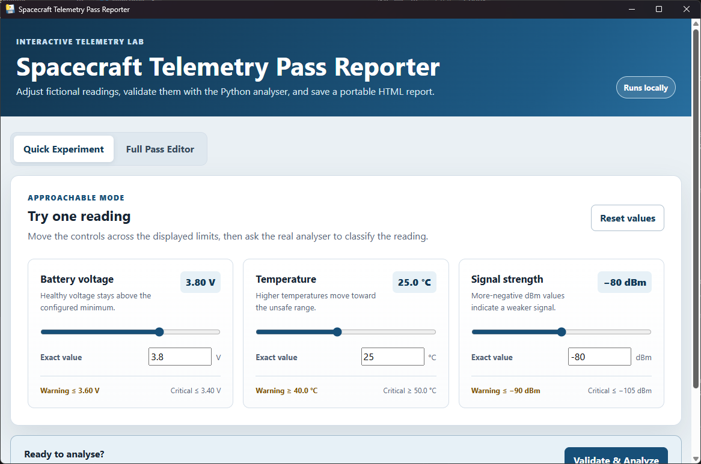
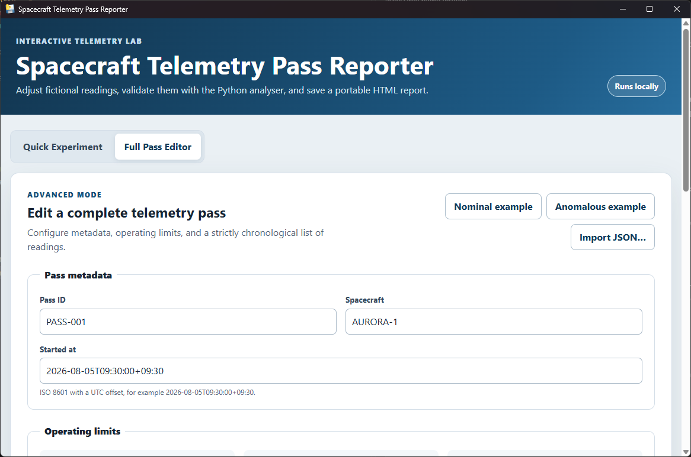
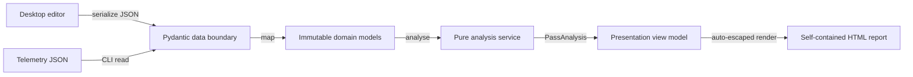

# Spacecraft Telemetry Pass Reporter

An AI-assisted learning and portfolio project with a guided Windows desktop application and an
advanced Python command-line interface. It validates fictional spacecraft-pass telemetry, applies
configurable operating limits, and produces a polished, self-contained HTML report. The emphasis
is on explicit boundaries, typed data, deterministic rules, actionable errors, and automated
verification.

> **Educational scope:** All spacecraft names and telemetry in this repository are fictional.
> This project is not a complete spacecraft-operations system and must not be used for mission
> decisions.

Two generated examples are included:

- [`examples/nominal-pass-report.html`](examples/nominal-pass-report.html)
- [`examples/anomalous-pass-report.html`](examples/anomalous-pass-report.html)

## Download the Windows app

For the simplest route, open the
[latest GitHub Release](https://github.com/luke-lachlan-day/spacecraft-telemetry-pass-reporter/releases/latest)
and download the versioned `spacecraft-telemetry-pass-reporter-*-windows-x64.zip` file and its
matching `.sha256` file. Verify the checksum, extract the whole ZIP, and run
`Telemetry Reporter.exe`; the adjacent `_internal` folder must remain in place. Python is not
required.

On PowerShell, this prints a hash that should match the first value in the downloaded `.sha256`
file:

```powershell
Get-ChildItem .\spacecraft-telemetry-pass-reporter-*-windows-x64.zip |
  Get-FileHash -Algorithm SHA256
```

The portable build supports Windows 10/11 x64 and uses the Microsoft Edge WebView2 Runtime. Current
Windows installations normally include it. If it is missing, the application offers to open the
[official Microsoft download page](https://developer.microsoft.com/microsoft-edge/webview2/); it
never falls back to the deprecated MSHTML renderer.

The portable release is unsigned. Windows SmartScreen may show an unrecognized-app warning, so
verify the published SHA-256 checksum before choosing to run it. There is no installer,
auto-updater, account, network service, telemetry collection, or persistence beyond files you
explicitly save.



The default **Quick Experiment** gives one current-UTC reading and paired sliders/numeric inputs.
**Full Pass Editor** provides metadata, configurable limits, editable reading rows, bundled
examples, and JSON import. In either mode, **Validate & Analyze** sends JSON through the same
Pydantic schema, domain model, analyser, and report renderer used by the CLI. Editing anything
invalidates the prior result until it is analysed again.



## Supported interface

The supported public interfaces are `telemetry-report-gui`, `telemetry-report` (including its
equivalent `python -m telemetry_report` entry point), the documented JSON input contract, CLI exit
codes, and generated report behaviour. `telemetry-report-gui --self-test` validates the packaged
examples and report pipeline without opening a window. Importable `telemetry_report.*` modules,
domain types, and the pywebview bridge are implementation details and may change without
compatibility aliases.

The distribution retains PEP 561 type information so the implementation remains useful to inspect
with type-aware tooling. That marker does not make the internal Python modules a compatibility-stable
library API.

## Architecture

The package deliberately keeps one authoritative pipeline behind two adapters:

- **Data** validates untrusted JSON with Pydantic v2 and maps it into domain objects.
- **Domain** defines immutable telemetry, limit, status, and analysis value objects.
- **Services** applies pure threshold rules and calculates occurrences, counts, and statistics.
- **Presentation** builds an escaped view model and renders it with a Jinja2 HTML template.
- **CLI** handles paths, expected terminal failures, and atomic report output.
- **Desktop** supplies guided/full editors and native dialogs but does not classify telemetry.



This separation keeps Pydantic, files, terminal output, desktop JavaScript, and HTML out of the
business rules. The analyser accepts a validated `TelemetryPass` and returns a `PassAnalysis`
without side effects. The desktop backend retains only the latest normalized JSON/rendered HTML in
memory so stale analysis IDs cannot save an older result.

## Project structure

```text
.
├── src/telemetry_report/
│   ├── data/             # Pydantic schemas and JSON repository
│   ├── desktop/          # pywebview bridge, launcher, and packaged local UI
│   ├── domain/           # Framework-independent value objects
│   ├── presentation/     # HTML view model, renderer, and template
│   ├── services/         # Deterministic threshold analysis
│   ├── cli.py            # Argument parsing and dependency wiring
│   ├── file_io.py        # Shared atomic UTF-8 output
│   └── __main__.py       # python -m entry point
├── packaging/            # PyInstaller specification and release notes
├── sample-data/          # Nominal and warning/critical fictional passes
├── examples/             # Generated, reviewable HTML reports
├── tests/                # Unit and Playwright browser checks
├── .github/workflows/    # Cross-version quality and Windows release workflows
└── pyproject.toml        # Package metadata and tool configuration
```

## Advanced source setup

Python 3.11 or newer is required. From the repository root:

```bash
python -m venv .venv
```

Activate the environment on Windows PowerShell:

```powershell
.venv\Scripts\Activate.ps1
```

Or on macOS/Linux:

```bash
source .venv/bin/activate
```

Install the CLI, desktop application, and development tools:

```bash
python -m pip install --upgrade pip
python -m pip install -e ".[dev,desktop]"
```

Launch the desktop application from source:

```powershell
telemetry-report-gui
```

The source GUI is currently Windows-only. The CLI remains available from Python 3.11-3.14 on the
existing supported platforms. For a runtime-only CLI installation, install the package without any
optional dependency group.

## Generate a report from the CLI

Run the module directly:

```bash
python -m telemetry_report sample-data/anomalous-pass.json \
  --output examples/anomalous-pass-report.html
```

The installed console command is equivalent:

```bash
telemetry-report sample-data/nominal-pass.json --output examples/nominal-pass-report.html
```

When `--output` is omitted, the reporter writes `<input-stem>-report.html` beside the input file.
The destination directory is created when needed. Input and output must identify different files,
including through path aliases, symbolic links, or hard links. Reports are written with an atomic
replacement so a failed write does not damage an existing report. Success returns exit code `0`;
invalid input and unsafe path combinations return `2`; output failures return `3`, with concise
messages on standard error. On POSIX systems, new reports use normal file-creation permissions
filtered through the process umask, while replacing an existing regular report preserves its mode.

## Input format

Each JSON document contains pass metadata, limits for all three supported metrics, and at least one
timestamped reading:

```json
{
  "pass_id": "PASS-001",
  "spacecraft": "AURORA-1",
  "started_at": "2026-08-05T09:30:00+09:30",
  "limits": {
    "battery_voltage": {"direction": "minimum", "warning": 3.6, "critical": 3.4},
    "temperature_c": {"direction": "maximum", "warning": 40.0, "critical": 50.0},
    "signal_strength_dbm": {"direction": "minimum", "warning": -90.0, "critical": -105.0}
  },
  "readings": [
    {
      "timestamp": "2026-08-05T09:30:00+09:30",
      "battery_voltage": 3.8,
      "temperature_c": 27.5,
      "signal_strength_dbm": -82.0
    }
  ]
}
```

Input files must be UTF-8 encoded. Timestamps must be ISO 8601 strings that include a UTC offset;
numeric epoch timestamps are rejected. Readings must be non-empty, unique, and strictly
chronological, and `started_at` must equal the first reading timestamp. Numeric values must be
finite JSON numbers: booleans and numeric strings are rejected. Unknown fields are also rejected.
Input files may be at most 5 MiB (5,242,880 bytes), and each pass may contain at most 10,000
readings. Fractional timestamp seconds are accepted and preserved in generated reports.

For a `minimum` rule, values at or below the warning threshold are warnings and values at or below
critical are critical. For a `maximum` rule, values at or above warning are warnings and values at
or above critical are critical. Consequently, a minimum warning threshold must be greater than its
critical threshold; maximum thresholds use the opposite ordering. The most severe metric determines
the reading status, and the most severe reading determines the pass status.

## Quality checks

```bash
ruff format --check .
ruff check .
mypy src
pytest
```

`pytest` is configured to measure branch coverage for the application package and fail below 90%.
To apply formatting before checking, run `ruff format .`.

Browser checks are optional for ordinary CLI installations. To install their isolated dependency
group and run the responsive report, print/PDF, and desktop UI checks locally:

```bash
python -m pip install -e ".[dev,browser]"
python -m playwright install chromium
pytest tests/browser --no-cov
```

The GitHub Actions workflow runs formatting, linting, mypy, and the complete coverage-enabled test
suite on Python 3.11, 3.12, 3.13, and 3.14. A separate Python 3.11 job builds the wheel, installs it
into a clean virtual environment, checks its dependencies, and verifies that the installed console
command reproduces the checked-in anomalous report. A dedicated Chromium job checks reports at 280,
320, 375, and 1440 pixels, print media/PDF output, accessibility-oriented UI behavior, and browser
errors. Screenshots and the PDF are uploaded as short-lived artifacts only when that job fails.

The Windows release workflow installs `.[build]`, builds the committed one-folder PyInstaller
specification on Python 3.13 x64, runs the packaged `--self-test`, and publishes a versioned ZIP plus
SHA-256 checksum. A manual equivalent build starts with:

```powershell
python -m pip install -e ".[build]"
pyinstaller packaging\telemetry_reporter.spec --noconfirm --clean
```

## Design decisions and trade-offs

- **Validation stops at the boundary.** Pydantic provides precise external-data errors, while the
  rest of the application uses frozen standard-library dataclasses and enums.
- **The metric set is explicit.** Three named fields introduce a little repetition, but preserve
  strong types and keep the supported input contract obvious. A dynamic plug-in system would be
  unnecessary for this project's scope.
- **Threshold equality is unsafe-side inclusive.** Exact boundaries consistently become warning or
  critical, avoiding ambiguous edge behaviour.
- **Occurrences are metric-level.** Each unsafe metric sample produces one chronological
  out-of-limit occurrence. These are observations at each timestamp, not only state-transition
  events such as entry, escalation, or recovery.
- **Rendering is self-contained.** Embedded CSS makes reports portable and offline-friendly. There
  is no JavaScript, external font, CDN, database, or network dependency. Dense panels reflow on
  narrow screens, while the chronological table keeps any horizontal scrolling within its frame.
- **The desktop is an adapter, not a second analyser.** JavaScript manages form usability and
  preview state. Only validated Python domain analysis determines status, counts, and report prose.
- **Desktop saves are explicit and current.** Every edit invalidates the cached result. Native
  dialogs write only content associated with the latest opaque analysis ID, using the same atomic
  UTF-8 output helper as the CLI.
- **Measurement precision is preserved.** Reports use a consistent minimum precision for each
  metric and retain additional meaningful digits from readings and configured thresholds. Extreme
  finite magnitudes use compact scientific notation, and statistics avoid intermediate overflow.
- **Statistics are descriptive.** Minimum, maximum, and arithmetic mean are useful for demonstration
  but do not model sensor uncertainty, sampling gaps, calibration, or operational trend analysis.
  Signal-strength average is the arithmetic mean of dBm samples; because dBm is logarithmic, this
  is not equivalent to averaging received power.

## Scope limitations

This educational application processes a fixed JSON schema and three metrics. The portable GUI is
limited to Windows x64; other users need Python and the CLI/source installation. It does not provide
authentication, streaming ingestion, persistence, command verification, alert acknowledgement,
redundancy, unit conversion, audit controls, sensor-quality modelling, or any certification expected
of real mission software. The sample values are plausible-looking fiction, not real telemetry.

## Responsible AI assistance

This project was developed with substantial AI assistance across architecture, implementation,
testing and documentation. I used it as a structured learning exercise and then worked through the
core Python models, telemetry-classification rules and report-building flow. I am continuing to learn
some of the supporting libraries and tooling.

## License

Released under the [MIT License](LICENSE).
